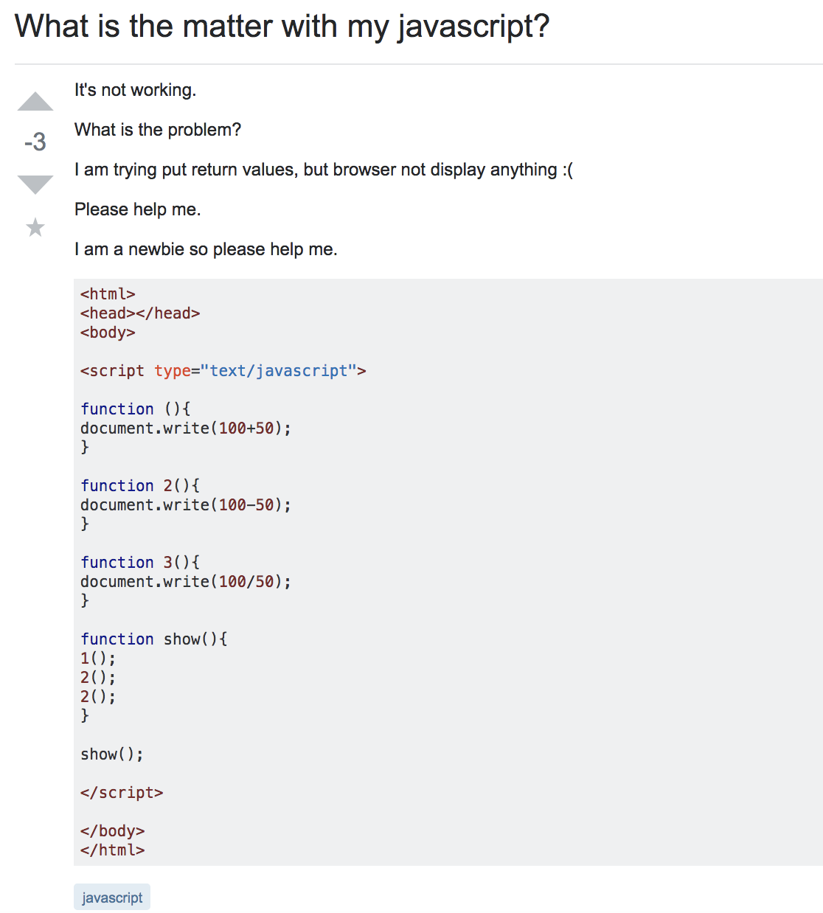
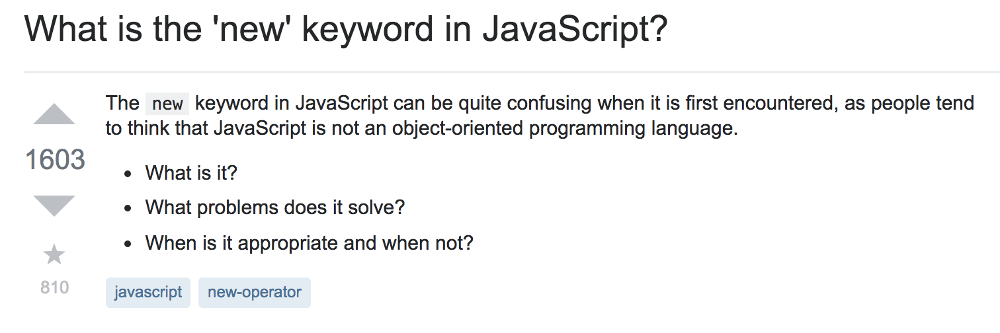

## Introduction
Is there a wrong way to ask a question? According to Eric Raymond there is definitely a wrong way to ask a question(aka the not so smart way). Raymond created a guide [How to Ask a Question the Smart Way](http://www.catb.org/esr/faqs/smart-questions.html) that will help you craft a smart question. 

## Whats the Wrong Way?

[Here](https://stackoverflow.com/questions/39498287/what-is-the-matter-with-my-javascript), is an example of a not so smart question. As Raymond said, you want your question to have a worth. The people who are answering questions want something that is thought provoking. Asking something like this is just being lazy. This person did not seem to put any effort in solving the issue themselves. A  quick search about functions would have taught them that numbers are not allowed in function names. Another obvious give away that this is a not so smart question is seen in the answer. The reply was one sentence, "you can't use numbers as function names". There is no elaboration because there is no reason to try and explain a concept that could have be learned themselves. 

## Don't Worry There are Good Questions Too!

[Here](https://stackoverflow.com/questions/1646698/what-is-the-new-keyword-in-javascript), is a smart question. The question-er has shown that while they know of "new", they want to be able to conceptually understand its functions as well. In addition, this question was not asked for their own personal gain. The answer to this question will also help a community of people who may also have a similar inquiry, unlike the not so smart question. Lastly, it is a smart question as the answer is just as thought provoking as the question itself. The person who answered this question took the time to craft a detailed response that will definitely help others learn.

## Conclusions
In conclusion, I have learned that when asking a question I need to make sure that it is thought provoking enough. Can I search and find the answer? Maybe a classmate might know? Could others benefit from me asking this question? Asking a smart question is not as simple as it sounds. But, it is very important skill to have. Asking a smart question can help you communicate with others so you all can learn.