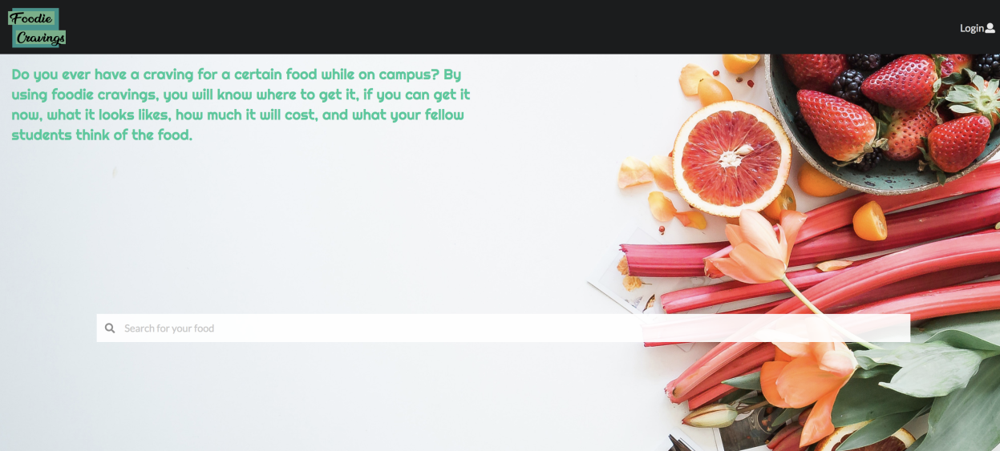

Our team decided to create a website that would allow users to review foods around the school. The motivation for this project was to create a website that would allow people to search up different foods around campus. They would then be able to see different reviews made by people as well as the price and location. Some of the features that we were able to implement were a search bar, a favorites system, and a comments section. 

You can check out the website we made [here](http://foodiecravings.meteorapp.com/#/)!

Our GitHub organization can also be found [here](https://github.com/foodiecravings).

## My Role
I contributed to the project by designing a profile page where users could add in information about them. I also got to implement a favorites system that would track each users favorite food. 

Because of this project I got to learn a lot more about what it takes to create a website. There is a lot of backend work that needs to be done in order to handle specific users. This project was a way for me to gain a better understanding on how to manage different collections in a database. Another thing I got to improve on is my GitHub skills. GitHub is an important tool for version control. It was very helpful as we were all making changes at once and GitHub help resolve a lot of merge conflicts. Lastly, team work was a very important factor for this project. There were many issues that we ran into. However, we all able to help and debug each others code when one of us got stuck. 