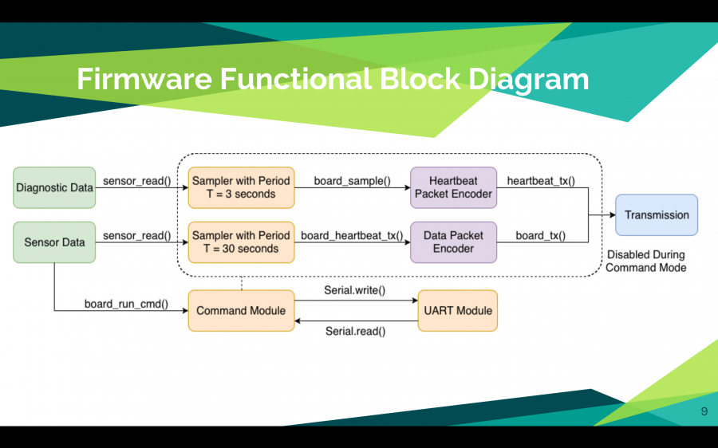

I work on a firmware team to help improve and develop firmware for a network of sensors. Theses sensors are able to collect data from the environment. The overall goal is to convert the University of Hawaii campus to run on 100% renewable energy. Our role is to deploy these sensor networks around the campus to help determine where solar panels and other renewable energy sources can be located.

Some applications that we utilize is [Atom](https://atom.io/) as our text editor. Another application is [Platformio](https://platformio.org/) to build and upload our firmware. We use a combination of C and C++ to write our code. The main goal is to create a packet,which contains our sensor data, that will be transmitted to our database. In addition to our sensor packet, we also have a second packet that contains the status of the network. Below is a block diagram of the packet creation and transmission. 

You can check out our website [here](http://scel-hawaii.org/)!