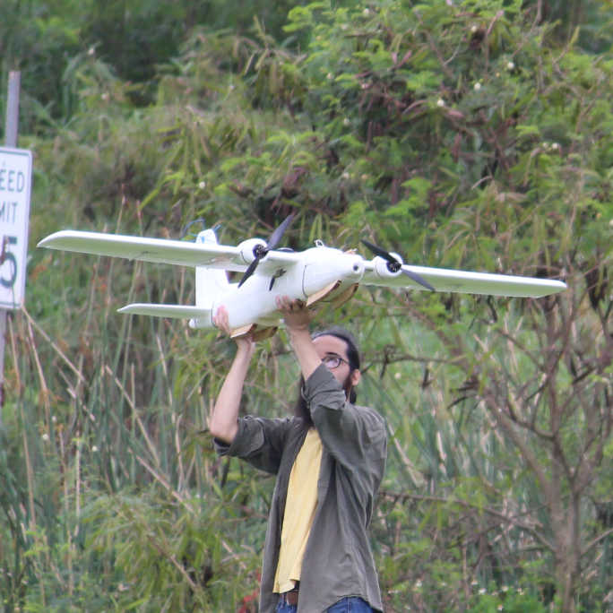

### University of Hawaii Drone Technologies

Imagine during a natural disaster you see a drone flying around. As it flies over you you see it drop supplies that will help you in this urgent time. University of Hawaii Drone Technologies, UHDT, is a project that strives to design a fully autonomous aerial system that can use object recognition to deliver supplies. 

My role in the electronic subsystem was to conduct research on geo tagging. We wanted to see if it was possible to geo tag targets in real time when deployed. To do this we needed to figure out a way to grab the GPS coordinated and have them sent down to our ground control station. In addition to conducting research I also was in charge of monitoring flights. By recording all our flights we were able to review our flights and see if there were any improvements that needed to be made before the next flight. This project helped me grow as an engineer as I learned that there is always room for improvements.